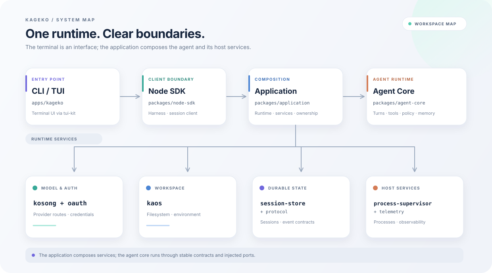

<div align="center">
  
  <p><strong>A terminal-based coding agent for real repositories.</strong><br />Inspect, change, and run code through one resumable, permission-aware workflow.</p>
  <p>
    <a href="https://nodejs.org/"></a>
    <a href="./LICENSE"></a>
  </p>
  <p><a href="./README.zh-CN.md">简体中文</a></p>
</div>

## What is Kageko?

Kageko is an AI coding agent that runs in your terminal and works in the repository you choose. Use the interactive TUI for an ongoing session or run a prompt from a script or CI job. Sessions can be resumed, and tool use is governed by separate permission and interaction settings.

## Features

- **Interactive and headless use.** Start the TUI, or run one prompt with text, JSON, or streaming JSON output.
- **Repository tools.** Read, write, and edit files; search the workspace; run shell commands; search the web; and fetch URLs.
- **Resumable sessions.** Continue the latest workspace session, resume a specific one, or fork a session to explore another approach.
- **Agent workflows.** Use subagents, plans, goals, and scheduled prompts for work that spans multiple steps.
- **Extensible capabilities.** Add MCP servers, skills, and plugins. Workspace trust and tool permissions apply to sensitive operations.
- **Memory with review.** Inspect session memory and review learning proposals before accepting them.

## Quick start

### Requirements

- Node.js 24 or later (`.nvmrc` pins the repository's development version).
- npm, installed with Node.js.

### Install from source

```sh
git clone --branch agent-0.x --single-branch https://github.com/fumitoshi0524/KagekoO_O.git
cd KagekoO_O
npm run install:global
kageko setup
```

`install:global` installs dependencies, builds the workspaces, and installs the `kageko` command globally. `kageko setup` opens the provider and model setup flow.

Once the npm package is published, the standalone CLI can also be installed with
`npm install --global @kageko/app`.

### Start a session

Run Kageko from the repository you want to work on:

```sh
cd /path/to/your/project
kageko
```

Type a request in the TUI. Use `/help` to see available commands. Prefix an input with `!` to run it as a supervised shell command.

### Run a prompt without the TUI

```sh
kageko --prompt "Explain the main directories" --output text
kageko --prompt "Summarize changed files" --output json
kageko --prompt "Run the relevant tests" --output stream-json
```

Continue or resume work:

```sh
kageko --continue
kageko --resume <session-id>
kageko --resume   # Open the session picker in an interactive terminal
```

Choose a provider or model for a run with `--provider` and `--model`, or configure them in `kageko setup`.

## Providers

The setup flow currently offers:

- OpenAI Codex OAuth and OpenAI API
- OpenRouter
- Kimi Code OAuth and Kimi / Moonshot API routes (global and China)
- DeepSeek and Xiaomi MiMo
- Custom OpenAI-compatible endpoints

## Permissions

Permission scope and interaction mode are configured independently:

| Option | Values | Purpose |
| --- | --- | --- |
| `--permission` | `manual`, `workspace`, `unrestricted` | Sets the permission profile for tool actions. |
| `--interaction` | `interactive`, `unattended` | Controls whether a run can ask the user for input. |

The default profile is `manual`; the default interaction mode is `interactive`. In the TUI, use `/trust` to inspect or change trust for the current workspace.

Read the [security boundaries](./docs/security-boundaries.md) and [pre-release security review](./docs/security-review.md) before using shell tools, unattended mode, or project extensions.

## Architecture

Kageko keeps the terminal adapter separate from the application runtime. The application composes the agent core with model, workspace, session, and process services.

<p align="center">
  
</p>

| Workspace | Responsibility |
| --- | --- |
| `apps/kageko` | CLI and product TUI |
| `packages/node-sdk` | Application interface and session client used by the CLI |
| `packages/application` | Runtime composition, session services, and application entry point |
| `packages/agent-core` | Agent turns, tools, permissions, memory, and subagents |
| `packages/session-store` | Session persistence and event journal |
| `packages/process-supervisor` | Child process and background task lifecycle |
| `packages/protocol` | Shared event and type contracts |
| `packages/kaos`, `kosong`, `oauth`, `telemetry`, `tui-kit` | Workspace operations, model access, credentials, observability, and terminal UI components |

## Development

```sh
npm install
npm run build
npm test
npm run lint
npm run format:check
```

`npm test` builds the workspaces, then runs unit and product acceptance suites. `npm run verify:package` packs the CLI, installs it outside the workspace, and checks startup. `npm run test:e2e` runs the longer production-learning acceptance scenario against a local test model.

## Community

- [Open an issue](https://github.com/fumitoshi0524/KagekoO_O/issues)
- Licensed under the [MIT License](./LICENSE)
