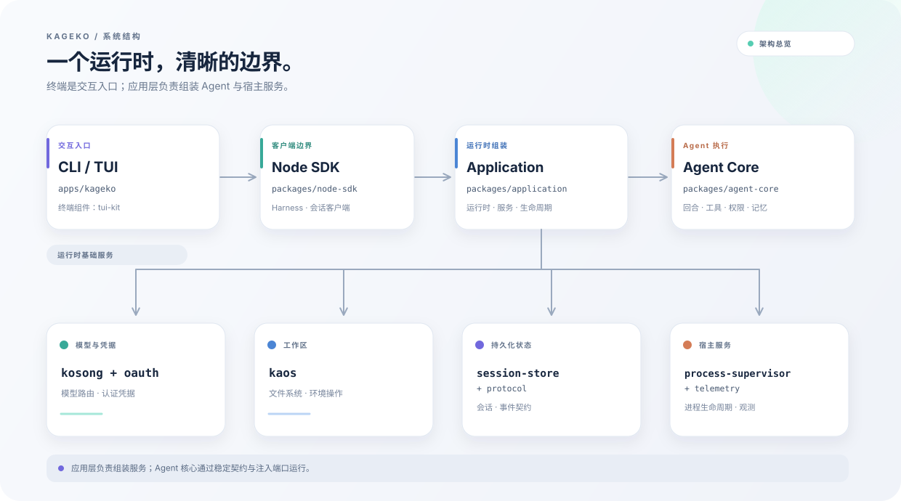

<div align="center">
  
  <p><strong>面向真实代码仓库的终端编程代理。</strong><br />在可恢复、受权限控制的工作流中检查、修改并运行代码。</p>
  <p>
    <a href="https://nodejs.org/"></a>
    <a href="./LICENSE"></a>
  </p>
  <p><a href="./README.md">English</a></p>
</div>

## Kageko 是什么？

Kageko 是一个运行在终端中的 AI 编程代理，可以在你选择的代码仓库里工作。你可以通过交互式 TUI 持续协作，也可以从脚本或 CI 发起单次任务。会话支持恢复；工具操作由权限范围和交互模式分别控制。

## 功能

- **交互与无界面运行。** 启动 TUI，或执行单次 prompt 并输出文本、JSON、流式 JSON。
- **仓库工具。** 读取、写入和编辑文件；搜索工作区；运行 Shell 命令；搜索网页并获取 URL。
- **可恢复会话。** 继续当前工作区最近的会话、恢复指定会话，或分叉会话来尝试另一种方案。
- **Agent 工作流。** 使用 subagent、计划、目标和定时 prompt 处理多步任务。
- **扩展能力。** 接入 MCP server、skill 和 plugin；敏感操作受工作区信任和工具权限控制。
- **可审核的记忆。** 查看会话记忆，并在接受学习建议前进行审核。

## 快速开始

### 环境要求

- Node.js 24 或更高版本（仓库开发版本见 `.nvmrc`）。
- npm 随 Node.js 一同安装。

### 从源码安装

```sh
git clone --branch agent-0.x --single-branch https://github.com/fumitoshi0524/KagekoO_O.git
cd KagekoO_O
npm run install:global
kageko setup
```

`install:global` 会安装依赖、构建所有 workspace，并将 `kageko` 命令安装到全局。`kageko setup` 会打开 provider 与模型设置向导。

npm 包发布后，也可以通过 `npm install --global @kageko/app` 独立安装 CLI。

### 开始会话

在要处理的仓库目录中运行 Kageko：

```sh
cd /path/to/your/project
kageko
```

在 TUI 中输入任务描述。使用 `/help` 查看可用命令；输入前缀 `!` 可运行受 supervisor 管理的 Shell 命令。

### 无 TUI 运行 prompt

```sh
kageko --prompt "Explain the main directories" --output text
kageko --prompt "Summarize changed files" --output json
kageko --prompt "Run the relevant tests" --output stream-json
```

继续或恢复工作：

```sh
kageko --continue
kageko --resume <session-id>
kageko --resume   # 在交互式终端中打开会话选择器
```

可以通过 `--provider` 和 `--model` 为本次运行选择模型，也可以使用 `kageko setup` 进行配置。

## 模型服务

设置向导目前提供：

- OpenAI Codex OAuth 与 OpenAI API
- OpenRouter
- Kimi Code OAuth 与 Kimi / Moonshot API（国际及中国路由）
- DeepSeek 与 Xiaomi MiMo
- 自定义 OpenAI-compatible endpoint

## 权限

权限范围和交互模式分别配置：

| 选项 | 可选值 | 用途 |
| --- | --- | --- |
| `--permission` | `manual`、`workspace`、`unrestricted` | 设置工具操作的权限配置。 |
| `--interaction` | `interactive`、`unattended` | 控制运行期间是否可以向用户询问。 |

默认权限配置为 `manual`，默认交互模式为 `interactive`。在 TUI 中使用 `/trust` 查看或管理当前工作区的信任状态。

使用 Shell 工具、无人值守模式或项目扩展前，请阅读[安全边界说明](./docs/security-boundaries.zh-CN.md)及[发布前安全专项审查](./docs/security-review.zh-CN.md)。

## 架构

Kageko 将终端界面与应用运行时分开。应用层负责把 Agent 核心与模型、工作区、会话和进程服务组装起来。

<p align="center">
  
</p>

| Workspace | 职责 |
| --- | --- |
| `apps/kageko` | CLI 与产品 TUI |
| `packages/node-sdk` | CLI 使用的应用接口与会话客户端 |
| `packages/application` | 运行时组装、会话服务与应用入口 |
| `packages/agent-core` | Agent 回合、工具、权限、记忆与 subagent |
| `packages/session-store` | 会话持久化与事件日志 |
| `packages/process-supervisor` | 子进程与后台任务生命周期管理 |
| `packages/protocol` | 共享事件与类型契约 |
| `packages/kaos`、`kosong`、`oauth`、`telemetry`、`tui-kit` | 工作区操作、模型接入、凭据、运行观测与终端界面组件 |

## 本地开发

```sh
npm install
npm run build
npm test
npm run lint
npm run format:check
```

`npm test` 会构建 workspace，再运行单元测试和产品验收测试。`npm run verify:package` 会打包 CLI、在仓库外安装并检查启动。`npm run test:e2e` 会使用本地测试模型运行较完整的 production-learning acceptance 场景。

## 社区

- [提交 Issue](https://github.com/fumitoshi0524/KagekoO_O/issues)
- 项目使用 [MIT License](./LICENSE)
