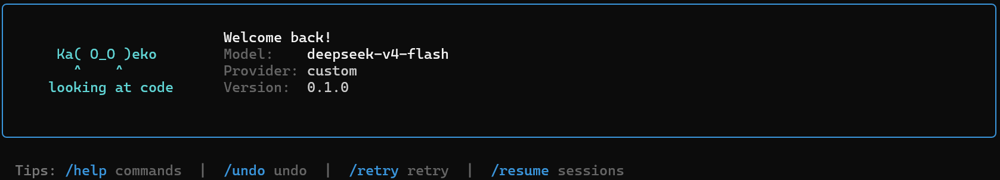

# Kageko

三合一 AI 代理：编码、通用、研究。  
[English](README.md)

---

---


## 功能特性

- **多提供商** — OpenAI、DeepSeek（含 reasoner）、Ollama 及任何兼容 OpenAI API 的服务
- **交互式 CLI** — 基于 Rich 的聊天，流式输出、工具卡片、方向键权限菜单
- **TUI** — 完整的 Textual 终端 UI，多面板代理交互
- **工具系统** — 文件读写、Shell 执行、grep 搜索、AST 分析、hashline 编辑、MCP 客户端
- **子代理委派** — 生成隔离的子代理执行并行任务
- **QAOA 模式** — 问答-行动-观察-答案轨迹，用于研究任务
- **记忆与技能** — FTS5 持久记忆，从对话中提取技能
- **上下文压缩** — 三层策略：工具输出剪枝 → 图片剥离 → LLM 摘要
- **安全护栏** — 危险命令规则引擎、失败追踪、幂等性检测
- **安全模式** — 宽松、只读、交互式（支持会话级"永久允许"）

## 快速开始

```bash
git clone https://github.com/your-org/kageko.git
cd kageko
pip install -e .

# 设置向导
kageko setup

# 开始聊天
kageko chat

# 单次查询
kageko chat "解释一下这个代码库"

# TUI 模式
kageko tui
```

## 配置

编辑 `~/.kageko/kageko.toml`（由 `kageko setup` 创建）：

```toml
[agent]
model = "deepseek-chat"       # 或 gpt-4o, deepseek-reasoner, llama3
mode = "tool-use"              # tool-use | qaoa
max_turns = 20
provider = "deepseek"          # openai | deepseek | ollama

[security]
mode = "interactive"           # permissive | read-only | interactive

[database]
path = "~/.kageko/kageko.db"

[logging]
level = "INFO"
```

环境变量（优先级高于 TOML）：
- `KAGEKO_API_KEY` — API 密钥
- `KAGEKO_MODEL` — 模型名称
- `KAGEKO_BASE_URL` — API 地址
- 提供商专用：`OPENAI_API_KEY`、`DEEPSEEK_API_KEY`

## 提供商

| 提供商 | 模型 | 备注 |
|--------|------|------|
| `openai` | gpt-4o, gpt-4o-mini | 默认 |
| `deepseek` | deepseek-chat, deepseek-reasoner | reasoner 不支持 tools/temperature |
| `ollama` | llama3, ... | 本地运行；需设置 `base_url` |

## 项目结构

```
KagekoO_O/
├── src/kageko/
│   ├── cli.py              # CLI 入口：chat, tui, setup, version
│   ├── config.py           # TOML + 环境变量配置加载
│   ├── types.py            # Message, ToolCall, StreamToken, AgentResult
│   ├── agent/
│   │   ├── loop.py         # AgentEngine：run, run_stream
│   │   ├── context.py      # 上下文压缩
│   │   ├── permissions.py  # 安全管道
│   │   ├── guardrails.py   # 规则引擎
│   │   ├── delegate.py     # 子代理生成
│   │   └── ttsr.py         # 流拦截器
│   ├── llm/
│   │   ├── adapter.py      # OpenAI 兼容的 LLM 客户端
│   │   └── providers.py    # 提供商配置文件及模型信息
│   ├── tools/
│   │   ├── registry.py     # 工具注册表
│   │   ├── builtin/        # 文件、Shell、grep、AST、hashline
│   │   └── mcp_client.py   # MCP 协议客户端
│   ├── data/
│   │   └── db.py           # SQLite + FTS5 数据库
│   ├── learning/
│   │   ├── memory.py       # 记忆管理器
│   │   ├── skills.py       # 技能引擎
│   │   └── curator.py      # 维护任务
│   ├── repl/               # CLI 渲染：流、diff、提示、工具卡片
│   ├── tui/                # Textual TUI 应用
│   └── gateway/            # 多平台消息网关（开发中）
├── kageko.toml             # 项目级配置示例
├── pyproject.toml
└── docs/
```

## 致谢

Kageko 的设计汲取了以下工作的灵感：

- [Hermes](https://github.com/NousResearch/hermes-agent) — 多平台智能体框架，具备持久学习循环
- [oh-my-pi (omp)](https://github.com/can1357/oh-my-pi) — hash 锚点编辑、优化工具链、多智能体子代理
- [UniToolCall](https://github.com/EIT-NLP/UniToolCall) — 面向异构 LLM 后端的统一工具调用协议

## 许可证

[MIT](LICENSE)
